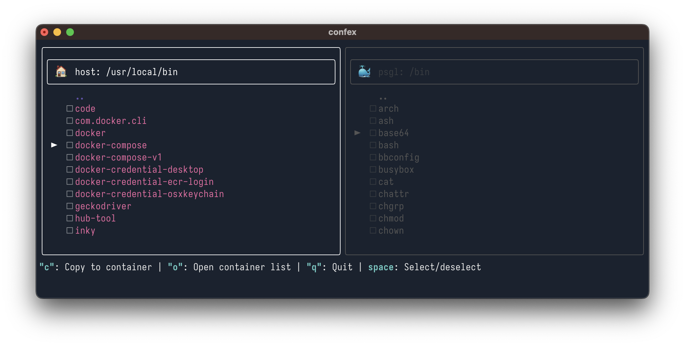

# Confex

Container file explorer: easy file access and transfer for your docker containers, with native experience

## Usage

| Keys               | Description                                                                                     |
| ------------------ | ----------------------------------------------------------------------------------------------- |
| `h`, `j`, `k`, `l` | Navigation                                                                                      |
| `o`                | Open running container list                                                                     |
| space              | Select/deselect items                                                                           |
| `c`                | Copy selected items from active pane to the other pane                                          |
| `q`                | <ul><li>**main screen:** Quit </li><li>**container list screen:** Back to main screen</li></ul> |
